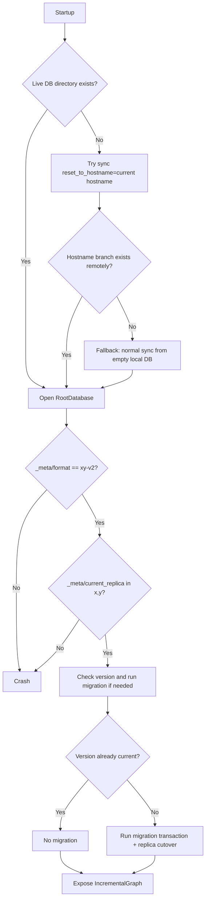

# IncrementalGraph Database Boot Sequence

## 1) Purpose

Define a deterministic, correctness-first startup protocol for IncrementalGraph database initialization.

The protocol is intentionally fail-fast: it prefers crashing on ambiguous or structurally invalid state over silently starting from a potentially wrong state.

---

## 2) Data model and storage layers

Volodyslav uses two coordinated stores for generators data:

1. **Live LevelDB (authoritative at runtime)**
   - Path: `<workingDirectory>/generators-leveldb`
   - Root metadata includes:
     - `_meta/format`
     - `_meta/current_replica`
   - Replicated graph namespaces: `x` and `y`.

2. **Git-tracked rendered snapshot (synchronization/checkpoint projection)**
   - Path: `<workingDirectory>/generators-database/rendered`
   - Contains filesystem render of active data (`r/`) and metadata (`_meta/`).

The boot protocol decides how the live LevelDB is seeded/opened; the snapshot repository is a synchronization dependency, not the runtime source of truth.

---

## 3) Assumptions / Preconditions (not protocol guarantees)

These are external preconditions the protocol relies on:

1. **Hostname env is initialized**
   - `VOLODYSLAV_HOSTNAME` is present and valid before startup proceeds.

2. **Single-process startup per working directory**
   - At most one process executes this boot sequence against the same working directory at a time.

3. **Trust model for storage shape**
   - If local live DB directory exists, it is assumed structurally readable by LevelDB.
   - If remote hostname branch exists, its rendered data is assumed structurally well-formed for scanning/merge.
   - Arbitrary corruption-repair logic is out of scope for this protocol.

4. **Directory-existence check semantics**
   - “Live DB exists” means directory existence at `generators-leveldb`; deeper structural checks happen only during DB open/validation.

---

## 4) Successful-startup postconditions

If startup completes successfully, all of the following hold:

1. Live DB directory exists.
2. Root format marker is valid (`xy-v2`).
3. Replica pointer is valid (`x` or `y`).
4. Active replica version is current application version (either already current or migrated during startup).
5. IncrementalGraph is exposed only after the above conditions are satisfied.

---

## 5) Conceptual phases

1. **Bootstrap source selection** (only if live DB directory is missing).
2. **Open + structural validation** (format marker + replica pointer).
3. **Version check + migration** (if version mismatch).
4. **Expose initialized graph**.

Each phase addresses one class of risk and does not mix responsibilities.

---

## 6) Boot flow (high-level)

---

## 7) Detailed protocol

### 7.1 Bootstrap when live DB is missing

Trigger: `<workingDirectory>/generators-leveldb` does not exist.

Ordered behavior:

1. Read current hostname (`VOLODYSLAV_HOSTNAME`).
2. Attempt sync with `resetToHostname=<hostname>`.
3. If reset fails specifically because `<hostname>-main` does not exist remotely:
   - run normal sync (no reset) from empty local DB.
4. Any other sync/reset failure is fatal.

### 7.2 Open + structural validation

On open, enforce:

1. Existing DB format marker must be exactly `xy-v2`; otherwise crash.
2. Replica pointer must exist and be one of `x|y`; otherwise crash.
3. Fresh DB initialization writes required root metadata.

### 7.3 Version check + migration

After structural validation:

1. Read active replica version metadata.
2. If no version is recorded (fresh DB), record current version.
3. If version equals current version, continue.
4. If version differs, run migration transaction and then switch active replica.

### 7.4 Exposure boundary

IncrementalGraph becomes available only after bootstrap/open/validation/migration complete successfully.

---

## 8) Failure semantics

1. **Format mismatch** (`_meta/format != xy-v2`) -> fatal startup crash.
2. **Invalid replica pointer** -> fatal startup crash.
3. **Unexpected reset/sync failure** (non-"hostname branch absent") -> fatal startup crash.
4. **Migration failure** -> fatal startup crash.

### Scope of consistency claim on migration failure

This document claims consistency at the **live RootDatabase state boundary** (replica data + active replica pointer semantics).

This document does **not** claim atomic rollback of every external side effect outside that boundary (for example, independently visible rendered snapshot/git side effects), unless explicitly guaranteed by the underlying transaction path.

---

## 9) Crash / restart semantics at important cut-points

This protocol is restart-safe by re-running deterministic checks from the beginning.

1. **Crash after reset-to-hostname success, before DB open**
   - Next start sees live DB present and proceeds to open/validate/version-check.

2. **Crash after fallback normal sync success, before DB open**
   - Next start follows same path as above (open/validate/version-check).

3. **Crash during migration before replica switch**
   - Active replica pointer remains at old replica; next start retries migration path.

4. **Crash after replica switch, before later non-critical side effects**
   - New replica is active on next start; startup continues from structural/version checks.

5. **Crash after successful migration, before interface exposure**
   - Next start re-checks state; version already current, no re-migration needed.

---

## 10) Observability requirements (inspectability contract)

For each startup attempt, logs should make these facts reconstructable:

1. Whether live DB directory existed at startup.
2. Chosen bootstrap path (none/reset/fallback).
3. Whether reset-to-hostname was attempted.
4. Whether fallback was taken and exact reason.
5. Detected format marker result.
6. Detected replica pointer result.
7. Detected active version and current app version.
8. Whether migration ran.
9. Final active replica and effective version.
10. Final startup result (success/fatal) and error class when failed.

---

## 11) Verification matrix

| ID | Scenario | Expected result |
|---|---|---|
| V1 | Live DB exists, valid, current version | Startup succeeds without migration |
| V2 | Live DB exists, valid, old version | Migration runs, then startup succeeds |
| V3 | Live DB missing, hostname branch exists | Reset bootstrap path used, then open/validate/migrate as needed |
| V4 | Live DB missing, hostname branch absent | Fallback normal sync path used, then open/validate/migrate as needed |
| V5 | Live DB exists, format mismatch | Fatal crash before graph exposure |
| V6 | Live DB exists, invalid replica pointer | Fatal crash before graph exposure |
| V7 | Live DB missing, reset path fails for unexpected reason | Fatal crash |
| V8 | Migration fails before replica switch | Fatal crash; previous active replica remains active |
| V9 | Migration fails around switch boundary | Fatal crash; next startup deterministically re-evaluates state |
| V10 | Repeated restart after any fatal path | Deterministic re-entry into protocol (no silent success from wrong state) |

---

## 12) Why this protocol is chosen

1. Keeps decision tree intentionally narrow and auditable.
2. Separates bootstrap concerns from structural validation and migration.
3. Limits fallback to one explicit expected condition (missing hostname branch).
4. Preserves strict fail-fast behavior for structural incompatibility.

---

## 13) Implementation touchpoints

- `backend/src/generators/interface/lifecycle.js` (startup orchestration boundary)
- `backend/src/generators/incremental_graph/database/root_database.js` (format/pointer checks)
- `backend/src/generators/incremental_graph/migration_runner.js` (version/migration behavior)
- `backend/src/generators/incremental_graph/database/gitstore.js` (migration snapshot/transaction integration)
- `backend/src/generators/incremental_graph/database/synchronize.js` (bootstrap sync behaviors)

---

## 14) Non-goals

1. Supporting legacy format markers (for example `xy-v1`).
2. Soft recovery from format mismatch.
3. General corruption-repair workflow for malformed local/remote data.
4. Expanding bootstrap fallback beyond the single explicit missing-hostname-branch condition.
