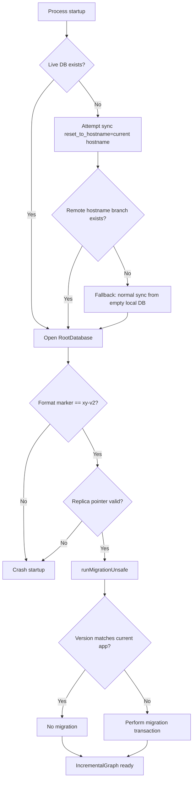
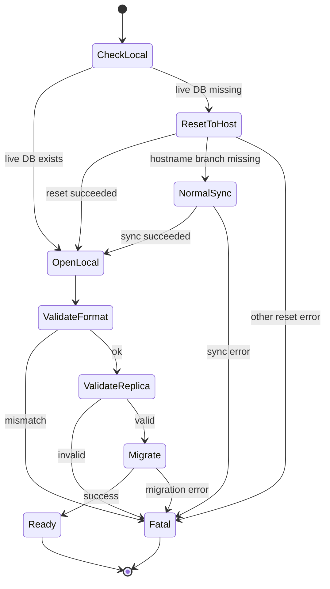

# IncrementalGraph Database Boot Sequence

## 1. Purpose

This document defines the startup/boot behavior for the IncrementalGraph database.

The goal is deterministic, inspectable initialization that never silently starts from the wrong state.

## 2. Data model and storage layers

Volodyslav uses two coordinated stores for generators data:

- **Live LevelDB**: `<workingDirectory>/generators-leveldb`
  - authoritative runtime store
  - contains `_meta/format`, `_meta/current_replica`, and `x|y` replicas
- **Git-tracked rendered snapshot**: `<workingDirectory>/generators-database/rendered`
  - serialized filesystem projection of live DB
  - synchronized across hosts via git

## 3. Required invariants

At successful startup:

1. Live database directory is present.
2. Root format marker equals `xy-v2`.
3. Replica pointer is valid (`x` or `y`).
4. Active replica version is either:
   - current app version (no migration needed), or
   - older version that is migrated before graph use.
5. If local live DB was absent on first boot, remote initialization policy is applied deterministically.

## 4. Conceptual startup phases

1. **Bootstrap source selection** (only when local live DB is missing).
2. **Open and validate structural metadata** (format + replica pointer).
3. **Open graph schema and execute migration if needed**.
4. **Expose initialized IncrementalGraph to the interface**.

## 5. Boot sequence (conceptual flow)

## 6. Detailed operational sequence

### 6.1 Bootstrap when live DB is absent

Condition: `<workingDirectory>/generators-leveldb` directory is missing.

Action order:

1. Read local hostname from `VOLODYSLAV_HOSTNAME`.
2. Run generators DB synchronization with `resetToHostname=<hostname>`.
3. If and only if remote branch `<hostname>-main` is missing:
   - run normal generators DB synchronization (no reset), starting from empty local DB and allowing standard merge behavior.
4. Any other error is fatal and startup fails.

### 6.2 Open + structural validation

`makeRootDatabase` then enforces:

- `_meta/format` must be `xy-v2` for existing DBs; mismatch is fatal.
- `_meta/current_replica` must exist and be `x` or `y`; invalid value is fatal.
- Fresh databases initialize `_meta/format` and `_meta/current_replica`.

### 6.3 Version + migration behavior

After successful open, startup executes migration logic:

- read active replica `meta/version`
- if no version exists: set current app version (fresh state)
- if version equals current app version: continue
- if version differs: execute migration callback in migration transaction (`runMigrationInTransaction`), including pre/post snapshot commits and replica switch

### 6.4 Failure semantics

- Format mismatch -> hard crash.
- Invalid replica pointer -> hard crash.
- Unexpected sync/reset failures during bootstrap -> hard crash.
- Migration failure -> hard crash (database remains in previous consistent state due transaction boundaries).

## 7. Bootstrap fallback state machine

## 8. Why this sequence is correct

- Prevents accidental silent empty-start when an expected host snapshot exists remotely.
- Handles first deployment of a new host cleanly (branch absent => normal merge sync from empty).
- Preserves strict incompatibility boundaries for storage format (`xy-v2` only).
- Keeps version migration responsibility exactly at graph initialization boundary.
- Keeps sync fallback narrowly scoped to one explicit case (missing hostname branch).

## 9. Implementation touchpoints

- `backend/src/generators/interface/lifecycle.js`
  - bootstrap-if-missing policy integrated before database open
- `backend/src/gitstore/working_repository.js`
  - explicit `ResetToHostnameNotFoundError` for missing remote host branch detection
- `backend/src/generators/incremental_graph/database/root_database.js`
  - format marker / replica pointer enforcement
- `backend/src/generators/incremental_graph/migration_runner.js`
  - version mismatch migration execution

## 10. Non-goals

- Supporting legacy format markers such as `xy-v1`.
- Soft-recovery on format mismatch.
- Best-effort migration on structurally invalid databases.

These are intentionally rejected to keep startup behavior deterministic and fail-fast.
