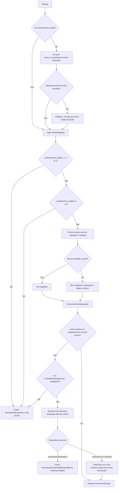

# IncrementalGraph Database Boot Sequence

## 1) Purpose

Define a deterministic, correctness-first startup protocol for IncrementalGraph database initialization.

The protocol is intentionally fail-fast: it prefers crashing on ambiguous or structurally invalid state over silently starting from a potentially wrong state.

This document specifies **startup behavior only**. It does not specify steady-state synchronization, runtime merge behavior outside boot, or corruption-repair workflows.

---

## 2) Data model and storage layers

Volodyslav uses two coordinated stores for generators data:

1. **Live LevelDB (authoritative at runtime)**
   - Path: `<workingDirectory>/generators-leveldb`
   - Root metadata includes:
     - `_meta/current_replica`
     - `_meta/current_replica`
   - Replicated graph namespaces: `x` and `y`.

2. **Git-tracked rendered snapshot (synchronization/checkpoint projection)**
   - Path: `<workingDirectory>/generators-database/rendered`
   - Contains filesystem render of active data (`r/`) and metadata (`_meta/`).

The boot protocol decides how the live LevelDB is seeded/opened; the snapshot repository is a synchronization dependency, not the runtime source of truth.

---

## 3) Preconditions, trust assumptions, terminology, and out-of-scope classes

### 3.1 Environment preconditions

1. `VOLODYSLAV_HOSTNAME` is present and valid before startup proceeds.
2. At most one process executes this boot sequence against the same working directory at a time.

### 3.2 Trust assumptions about inputs

1. If the live DB directory exists at boot entry, the protocol assumes it remains structurally readable and non-malformed for the duration of that boot attempt.
2. If `<hostname>-main` exists remotely, the protocol assumes its rendered data is structurally well-formed for the reset/scan/merge path.

### 3.3 Terminology used by this protocol

1. **Live DB exists**: directory existence at `<workingDirectory>/generators-leveldb` only.
2. **Fresh DB**: a newly initialized DB where active replica version metadata is absent.
3. **Current version**: the application version expected by the running build.
4. **Migration checkpoint**: the `checkpointSession`-based write sequence (via `checkpointMigration`) that prepares migrated replica state and records pre/post rendered snapshots.
5. **Replica cutover**: the committed switch of `_meta/current_replica` from old replica to migrated replica.
6. **Fatal startup crash**: startup abort where IncrementalGraph is not exposed.
7. **Structural validation**: boot-time checks for `_meta/current_replica == x or y` and `_meta/current_replica ∈ {x,y}`.
8. **Effective version**: the version metadata associated with the active replica after startup completes.

### 3.4 Out of scope

1. Arbitrary corruption detection/repair of malformed local or remote data.
2. Compatibility heuristics that attempt startup continuation after structural-contract violations.

---

## 4) Successful-startup postconditions

If startup completes successfully, all of the following hold:

1. A live LevelDB is present and openable at the runtime storage path.
2. Root current replica pointer is valid (`x or y`).
3. Replica pointer is valid (`x` or `y`).
4. Active replica version is current application version (either already current or migrated during startup).
5. IncrementalGraph is exposed only after the above conditions are satisfied.

---

## 5) Conceptual phases

1. **Bootstrap source selection** (only if live DB directory is missing).
2. **Open + structural validation** (current replica pointer + replica pointer).
3. **Version check + migration** (if version mismatch).
4. **Canonical-bootstrap gate** (Journal 3), after migration and before graph construction.
5. **Expose initialized graph**.

Each phase addresses one class of risk and does not mix responsibilities.

---

## 6) Boot flow (high-level)

```mermaid
flowchart TD
    A[Startup] --> B{Live DB directory exists?}
    B -->|Yes| C[Open RootDatabase]
    B -->|No| D[Try sync reset_to_hostname=current hostname]
    D --> E{Hostname branch exists remotely?}
    E -->|Yes| C
    E -->|No| F[Fallback: normal sync from empty local DB]
    F --> C

    C --> G{_meta/current_replica == x or y?}
    G -->|No| X[Crash]
    G -->|Yes| H{_meta/current_replica in x,y?}
    H -->|No| X
    H -->|Yes| I[Check version and run migration if needed]

    I --> J{Version already current?}
    J -->|Yes| K[No migration]
    J -->|No| L[Run migration checkpoint + replica cutover]

    K --> N[Canonical-bootstrap gate]
    L --> N

    N --> O{Active replica is a supported pre-Journal source?}
    O -->|No| M[Expose IncrementalGraph]
    O -->|Yes| P{Is a CohortBootstrapSource configured?}
    P -->|No| X[Crash: JournalPublicationError, fail closed]
    P -->|Yes| Q[Resolve the canonical bootstrap with the cohort]
    Q --> R{Resolution outcome}
    R -->|unresolved-publication| X2[Crash: UnresolvedCanonicalBootstrapError, nothing installed]
    R -->|canonical cut resolved| S[Install the cut in the inactive replica and move the pointer]

    S --> M
```

---

## 7) Detailed protocol

### 7.1 Bootstrap when live DB is missing

Trigger: `<workingDirectory>/generators-leveldb` does not exist.

Ordered behavior, as implemented by `internalBootstrap` in
`backend/src/generators/interface/lifecycle.js`:

1. Read current hostname (`VOLODYSLAV_HOSTNAME`) and the hostname branch name.
2. Query the remote with `git ls-remote --heads` for that branch. Any error here, including
   an unreachable remote, is a fatal startup crash.
3. If the branch exists remotely, run sync with `resetToHostname=<hostname>`, which restores
   the active replica from the remote snapshot.
4. If the branch does not exist remotely, initialize the checkpoint repository locally and
   then run a normal sync (no reset) from the empty local database.
5. Any sync/reset failure on either branch is fatal.

### 7.1.1 The installation-recovery protocol is not implemented

`incremental-graph-journal-checklist.md` §16a requires this section to describe the Journal 3
installation-recovery protocol of `database-lifecycle.md` §19: query an
`InstallationRecoverySource`, restore only on `Exists(ContinuationSafeSnapshot)`, mint a fresh
fingerprint only on `DefinitelyAbsent`, and fail on an indeterminate answer or an error. It also
requires the `resetToHostname` attempt and the fallback to normal sync from an empty local
database to be deleted.

That requirement is **not discharged**, and neither deletion was made here, because the symbols
the target protocol names do not exist in this branch:

* there is no `InstallationRecoverySource` in `backend/src`, and no `ContinuationSafeSnapshot`
  value type;
* `internalBootstrap` still performs the `git ls-remote` branch probe and the
  `resetToHostname` restore described in steps 2–4 above;
* `synchronizeNoLock` still owns the `options.resetToHostname` branch in
  `backend/src/generators/incremental_graph/database/synchronize.js`.

Deleting the two steps while `internalBootstrap` still executes them would make this document
describe a protocol the branch does not implement. The steps stay, the missing protocol is
named here, and both are a finding for the implementation front.

### 7.1.2 A missing live database is not a supported pre-Journal source

Under Journal 3 the gate in §7.4 distinguishes a replica that already retains Journal records
from one that does not. That distinction applies to a replica that has been opened, which is
what §7.2 requires. A live DB directory that is missing never reaches the gate in this shape,
so the recovery decision for a fresh installation is still the §7.1 behavior above.

### 7.2 Open + structural validation

On open, enforce:

1. Existing DB current replica pointer must be exactly `x or y`; otherwise crash.
2. Replica pointer must exist and be one of `x|y`; otherwise crash.
3. Fresh DB initialization writes required root metadata.

### 7.3 Version check + migration

After structural validation:

1. Read active replica version metadata.
2. If no version is recorded (fresh DB), record current version.
3. If version equals current version, continue.
4. If version differs, run migration checkpoint (via `checkpointMigration`) and then perform replica cutover.

`runMigration` is documented in `docs/specs/migration.md`. Where the persisted representation of
Journal records is itself being changed, the rewrite is owned by the Journal-aware
`JournalFormatCodec` in `docs/specs/incremental-graph-journal-migrations.md` instead.

### 7.4 Canonical-bootstrap gate

The gate runs after the migration gate and before graph construction. It is
`runCanonicalBootstrapGate`, re-exported from `backend/src/generators/incremental_graph/index.js`
and called by `internalCanonicalBootstrapGate` in
`backend/src/generators/interface/lifecycle.js`. The canonical behavior is stated by
`docs/specs/database-lifecycle.md`; this section records only where it sits in the boot order.

Ordered behavior:

1. Read the active replica once, through `readPreJournalSourceState`. Support is decided once,
   here, and nothing downstream re-derives it.
2. If the active replica already retains Journal records, or is fresh or empty, return
   `no-pre-journal-state` and stop. Startup of a Journal replica is unchanged.
3. If it is a supported pre-Journal source and no `CohortBootstrapSource` is configured, throw
   `JournalPublicationError`. Startup fails closed rather than creating a second canonical
   bootstrap.
4. Otherwise call `arbitrateCanonicalBootstrap` with the source, this replica's local writer,
   the target, and a staging closure. The answer is one of `use-canonical-artifact`,
   `cut-over-to-local-creator`, or `unresolved-publication`, or a `JournalError`.
5. On `cut-over-to-local-creator`, or on `use-canonical-artifact` naming this replica's own
   staged candidate, resume the creator and install.
6. On `use-canonical-artifact` naming another creator's artifact, join and install; the
   installed replica then retains two writers' records.
7. On `unresolved-publication`, including an indeterminate query, an indeterminate
   publication, `undefined`, and `false`, install nothing, leave the pre-Journal database as
   the active persisted state, and raise `UnresolvedCanonicalBootstrapError`.
8. On a `JournalError`, propagate it.

`internalCanonicalBootstrapGate` throws on outcome `unresolved-canonical-bootstrap` and otherwise
returns, so the gate is the last thing before `createIncrementalGraph` runs.

### 7.5 Exposure boundary

IncrementalGraph becomes available only after bootstrap/open/validation/migration/canonical
bootstrap complete successfully.

---

## 8) Failure semantics

1. **Format mismatch** (`_meta/current_replica != x or y`) -> fatal startup crash.
2. **Invalid replica pointer** -> fatal startup crash.
3. **Unexpected reset/sync failure** (non-"hostname branch absent") -> fatal startup crash.
4. **Migration failure** -> fatal startup crash.
5. **A supported pre-Journal replica with no configured `CohortBootstrapSource`** ->
   `JournalPublicationError`, fatal startup crash, nothing written.
6. **An unresolved canonical bootstrap** (indeterminate query, indeterminate publication,
   `undefined`, `false`, or any unrecognized answer) -> `UnresolvedCanonicalBootstrapError`,
   fatal startup crash, nothing installed and the pre-Journal database still the active
   persisted state.
7. **A `JournalError` from the source read, the arbitration, or either consumer** -> propagated
   by name. Those are compatibility and fork conditions, not outcomes to retry.

### Scope of consistency claim on migration failure

This document claims consistency at the **live RootDatabase boundary**, specifically:

1. active replica pointer (`_meta/current_replica`),
2. committed contents of the active replica namespace, and
3. version metadata used for subsequent boot decisions.

Migration/cutover guarantees are **restart-safety guarantees** around named cut-points, not a blanket claim of atomic rollback for every external side effect.

The following are outside this guarantee boundary unless explicitly covered by the same checkpoint/cutover path:

- rendered snapshot refresh work,
- git-visible checkpoint/update side effects,
- observability-only emissions.

---

## 9) Crash / restart semantics at important cut-points

This protocol is restart-safe by re-running deterministic checks from the beginning.

1. **Crash after reset-to-hostname success, before DB open**
   - Next start sees live DB present and proceeds to open/validate/version-check.

2. **Crash after fallback normal sync success, before DB open**
   - Next start follows same path as above (open/validate/version-check).

3. **Crash during migration checkpoint before replica cutover commit**
   - Active replica pointer remains at old replica; next start retries migration path.

4. **Crash after replica cutover commit, before follow-up side effects**
   - New replica is active on next start; startup continues from structural/version checks.
   - Follow-up side effects in this context are limited to rendered snapshot refresh, git-visible checkpoint updates, and observability emissions.

5. **Crash after successful migration, before interface exposure**
   - Next start re-checks state; version already current, no re-migration needed.

6. **Crash after the canonical cut was installed and the replica pointer moved**
   - The active replica now retains Journal records, so on the next start the gate returns
     `no-pre-journal-state` and never re-offers it to the cohort.

7. **Crash during publication, before the outcome was known**
   - Nothing was installed, so the next start re-reads the same supported pre-Journal source and
     re-queries the cohort. §6 of `incremental-graph-journal-migrations.md` requires a
     re-query before another publication attempt; the gate reports an unresolved outcome rather
     than retrying it inside one start. See the retry note in
     `docs/specs/database-lifecycle.md` §23.2.

---

## 10) Observability requirements (inspectability contract)

A compliant implementation must emit enough structured log information to reconstruct these facts for every startup attempt:

1. Whether live DB directory existed at startup.
2. Chosen bootstrap path (none/reset/fallback).
3. Whether reset-to-hostname was attempted.
4. Whether fallback was taken and exact reason.
5. Detected current replica pointer result.
6. Detected replica pointer result.
7. Detected active version and current app version.
8. Whether migration ran.
9. Whether cutover was committed and the final active replica/effective version.
10. The canonical-bootstrap gate outcome, and the final active replica/effective version after
    an install.
11. Final startup result (success/fatal) and error class when failed.

---

## 11) Verification matrix

| ID | Scenario | Expected result |
|---|---|---|
| V1 | Live DB exists, valid, current version | Startup succeeds without migration |
| V2 | Live DB exists, valid, old version | Migration runs, then startup succeeds |
| V2b | Fresh DB (no version recorded yet) | Current version is recorded without migration, then startup succeeds |
| V3 | Live DB missing, hostname branch exists | Reset bootstrap path used, then open/validate/migrate as needed |
| V4 | Live DB missing, hostname branch absent | Fallback normal sync path used, then open/validate/migrate as needed |
| V5 | Live DB exists, format mismatch | Fatal crash before graph exposure |
| V6 | Live DB exists, invalid replica pointer | Fatal crash before graph exposure |
| V7 | Live DB missing, reset path fails for unexpected reason | Fatal crash |
| V7b | Live DB exists but malformed (assumption violation) | Fatal crash path is explicit; classification recorded as assumption violation |
| V7c | Hostname branch exists but rendered data malformed (assumption violation) | Fatal crash path is explicit; classification recorded as assumption violation |
| V8 | Migration fails before cutover commit | Fatal crash; previous active replica remains active |
| V9 | Migration fails after cutover commit, before follow-up side effects | Fatal crash; new replica remains active on restart |
| V9b | Migration succeeds but rendered/git follow-up fails | Startup result matches restart-safe boundary; next boot deterministically re-evaluates |
| V10 | Repeated restarts at each crash cut-point | Deterministic re-entry into protocol (no silent success from wrong state) |
| V11 | Live DB exists and already retains Journal records | Gate returns `no-pre-journal-state`; startup is unchanged and the cohort is never contacted |
| V12 | Live DB exists and is a supported pre-Journal source with a configured source and an empty cohort | The replica's own cut is published, the creator is resumed, the cut is installed, the pointer moves, startup succeeds |
| V13 | Same, but the cohort already holds this replica's own staged candidate | The creator is resumed and installed with the persisted identifiers, payloads, and timestamps transported unchanged |
| V14 | Same, but the cohort holds another creator's artifact | The join is replayed and installed; the installed replica retains two writers' records |
| V15 | Supported pre-Journal source, cohort answer indeterminate or `undefined` or `false` | Nothing installed; no `records` and no `projection` on the result; `UnresolvedCanonicalBootstrapError`; pre-Journal database still active |
| V16 | Supported pre-Journal source, no `CohortBootstrapSource` configured | `JournalPublicationError`; nothing written |
| V17 | Install commits, then the process dies before interface exposure | Next start sees a Journal replica, returns `no-pre-journal-state`, and does not bootstrap again |

V17 is a specification-level expectation. `backend/tests/journal_startup_lifecycle.test.js`
covers V11–V16; no test drives a third startup after a committed install, so V17's re-entry
is not exercised directly. The `no-pre-journal-state` branch it relies on is covered by V11.

---

## 12) Why this protocol is chosen

1. Prefers startup refusal over compatibility heuristics when structural contracts are violated.
2. Prefers a narrow, auditable decision tree over flexible recovery logic.
3. Separates bootstrap concerns from structural validation and migration/cutover boundaries.
4. Accepts explicit trust assumptions on local/remote storage shape to keep boot logic simple.
5. Intentionally does not attempt self-healing from malformed inputs.

---

## 13) Implementation touchpoints

These touchpoints are informative and do not define protocol semantics.

- `backend/src/generators/interface/lifecycle.js` (startup orchestration boundary)
- `backend/src/generators/incremental_graph/database/root_database.js` (format/pointer checks)
- `backend/src/generators/incremental_graph/migration_runner.js` (version/migration behavior)
- `backend/src/generators/incremental_graph/database/gitstore.js` (migration snapshot/checkpoint integration)
- `backend/src/generators/incremental_graph/database/synchronize.js` (bootstrap sync behaviors)
- `backend/src/generators/incremental_graph/journal_bootstrap_gate.js` (the §7.4 gate)
- `backend/src/generators/incremental_graph/journal_bootstrap_source.js` (pre-Journal source read and support decision)
- `backend/src/generators/incremental_graph/journal_bootstrap_startup.js` (arbitration call and §6/§7 dispatch)
- `backend/src/generators/incremental_graph/journal_bootstrap_install.js` (atomic install into the inactive replica)
- `backend/src/generators/incremental_graph/journal/errors.js` (`JournalPublicationError`) and `backend/src/generators/interface/errors.js` (`UnresolvedCanonicalBootstrapError`)
- `backend/tests/journal_startup_lifecycle.test.js` (V11–V16, including two end-to-end starts through `InterfaceClass.ensureInitialized`)

---

## 14) Non-goals

1. Supporting legacy current replica pointers (for example `invalid value`).
2. Soft recovery from format mismatch.
3. General corruption-repair workflow for malformed local/remote data.
4. Expanding bootstrap fallback beyond the single explicit missing-hostname-branch condition.
5. The Journal 3 installation-recovery protocol of `database-lifecycle.md` §19.
   §7.1.1 states why, and `InstallationRecoverySource` does not exist in this branch.
6. Persisting a staged canonical candidate across a restart so that §6 can supply
   `stagedCandidate` on a retry. Nothing persists one today; a crashed publication attempt
   re-stages from the persisted pre-Journal state on the next start.

