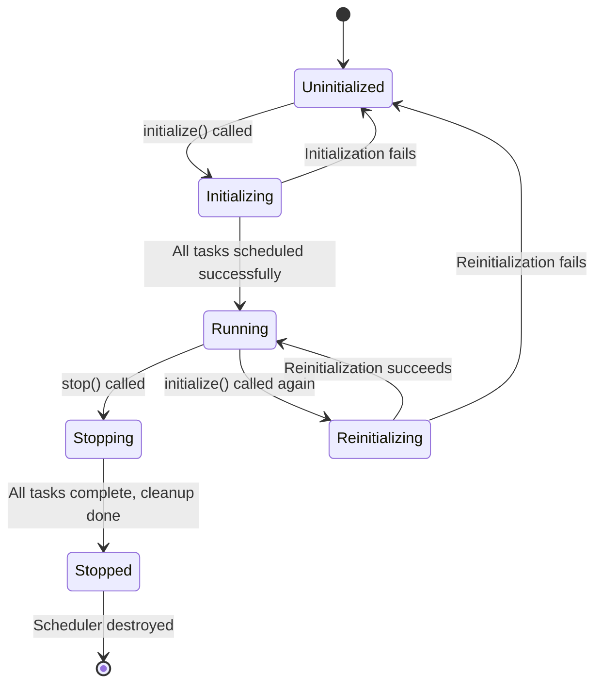
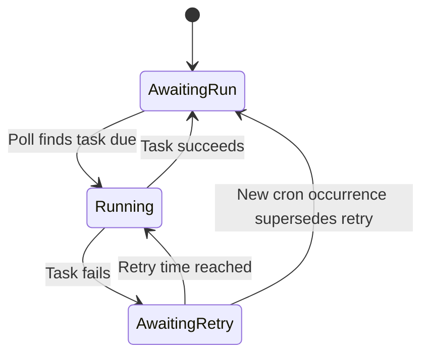
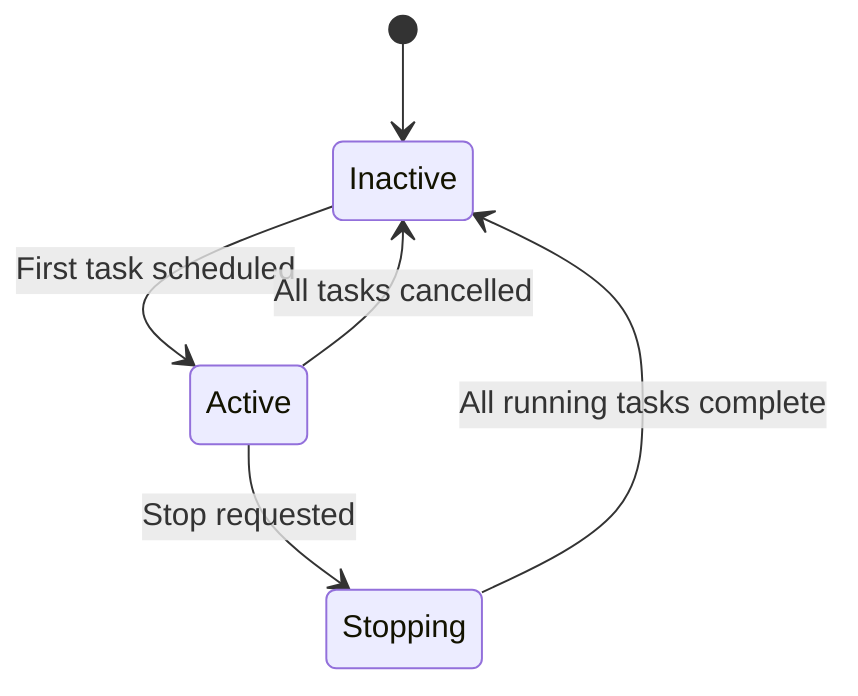

# Specification for the Declarative Polling Scheduler

This document provides a normative specification for the backend declarative polling scheduler's public interface and externally observable operational semantics.

---

## Introduction & Normative Language

This specification defines the externally observable behavior of the Declarative Polling Scheduler. It serves as:

- An integration contract for other teams
- A foundation for conformance testing
- A guide for independent re-implementations
- A behavioral lock for future refactors

### Normative Language

The key words "MUST", "MUST NOT", "REQUIRED", "SHALL", "SHALL NOT", "SHOULD", "SHOULD NOT", "RECOMMENDED", "MAY", and "OPTIONAL" in this document are to be interpreted as described in [RFC 2119](https://tools.ietf.org/html/rfc2119) and [RFC 8174](https://tools.ietf.org/html/rfc8174).

### Scope

**In scope:** Public interface (`initialize`, `stop`) and all externally observable behaviors including timing, persistence, logging, errors, and state transitions.

**Out of scope:** Internal module structure, private helper APIs, storage engine internals beyond externally visible effects.

---

## Public API Surface

The scheduler exposes exactly two public methods forming a minimal lifecycle interface.

### Scheduler Interface

A `Scheduler` instance **MUST** provide the following interface:

```javascript
interface Scheduler {
    initialize(registrations: Registration[]): Promise<void>
    stop(): Promise<void>
}
```

### Registration Format

A `Registration` **MUST** be a 4-tuple array with the following structure:

```javascript
type Registration = [
    string,     // Task name (unique identifier)
    string,     // Cron expression (POSIX format)
    Callback,   // Async function to execute
    Duration    // Retry delay duration
]
```

Where:
- **Task name** **MUST** be a non-empty string unique within the registration set
- **Cron expression** **MUST** be a valid POSIX 5-field cron expression
- **Callback** **MUST** be an async function `() => Promise<void>`
- **Duration** **MUST** be a non-negative time duration

---

## Operational Model & Time Semantics

### Time Provider and Granularity

The scheduler **MUST**:
- Use the host system's local clock as the authoritative time source
- Operate at minute-level granularity
- Evaluate task schedules at each minute boundary
- Consider a minute boundary to occur at the start of each minute (seconds = 0)

### Polling Behavior

The scheduler **MUST**:
- Poll for due tasks at regular intervals (implementation-defined frequency ≥ 1 minute)
- Execute all due tasks discovered during a poll
- Handle multiple due tasks in parallel with no ordering guarantees
- Continue polling as long as at least one task is scheduled
- Stop polling when no tasks are scheduled (optimization)

The scheduler **MUST**:
- Use the host system's local timezone for all time calculations
- Handle Daylight Saving Time (DST) transitions according to the host system's clock
- Consider a minute that does not exist during DST transitions (e.g., 2:30 AM during "spring forward") as automatically skipped
- Execute tasks **at most once** for minutes that occur twice during DST transitions (e.g., 2:30 AM during "fall back")
- Continue normal scheduling after DST transitions without requiring restart

**DST Transition Behavior:**
- **Spring Forward (Lost Hour):** Tasks scheduled during the skipped hour **MUST NOT** execute that day
- **Fall Back (Repeated Hour):** Tasks scheduled during the repeated hour **MUST** execute only during the first occurrence
- **Next Execution Calculation:** **MUST** correctly account for DST transitions when calculating future occurrences

### No Make-Up Execution Policy

**Critical Invariant:** When tasks miss multiple scheduled executions due to downtime, the scheduler **MUST** execute each task at most once when resuming, regardless of how many executions were missed.

**Rationale:** This prevents resource overwhelming and maintains predictable load patterns.

**Example:** A task scheduled `*/10 * * * *` (every 10 minutes) that misses 6 executions during a 1-hour outage **MUST** run only once when the scheduler resumes, not 6 times.

### Startup Semantics

#### First Startup (No Persisted State)

When no persisted state exists, the scheduler **MUST**:
1. Evaluate each task's cron expression against the current time
2. Execute immediately **only** those tasks whose cron expression **exactly matches** the current minute
3. Schedule all tasks for their next future occurrence

#### Subsequent Restarts (With Persisted State)

When persisted state exists, the scheduler **MUST**:
1. Load the previous execution state
2. Apply persistence override logic (see [Persistence Semantics](#persistence-semantics--overrides))
3. Continue normal scheduling based on last known attempt/success/failure times

---

## Scheduler Lifecycle

### Scheduler State Model

The scheduler **MUST** exist in exactly one of the following states:



### Scheduler State Definitions

- **Uninitialized:** Scheduler created but not yet initialized
- **Initializing:** Processing registrations, applying overrides, starting tasks
- **Running:** Normal operation with polling active and tasks scheduled
- **Reinitializing:** Re-processing registrations for idempotent initialization
- **Stopping:** Graceful shutdown in progress, waiting for running tasks
- **Stopped:** Cleanup complete, no active polling or tasks

### Scheduler State Transitions

#### Uninitialized to Initializing
**Guard:** `initialize(registrations)` called with valid input
**Action:** Begin validation, persistence override resolution
**Events:** `SchedulerInitializationStarted`

#### Initializing to Running
**Guard:** All registrations validated, overrides applied, tasks scheduled
**Action:** Start polling loop, mark scheduler as active
**Events:** `SchedulerInitializationCompleted`

#### Initializing to Uninitialized
**Guard:** Initialization fails due to validation or scheduling errors
**Action:** Clean up partial state, reset to uninitialized
**Events:** `SchedulerInitializationFailed`

#### Running to Reinitializing
**Guard:** `initialize(registrations)` called again (idempotent behavior)
**Action:** Compare new registrations with current state
**Events:** `SchedulerReinitializationStarted`

#### Running to Stopping
**Guard:** `stop()` called
**Action:** Stop accepting new polls, wait for running tasks
**Events:** `SchedulerStopRequested`

#### Stopping to Stopped
**Guard:** All running tasks complete, polling stopped
**Action:** Final cleanup, release resources
**Events:** `SchedulerStopped`

---

## Task Lifecycle

### Task State Model

Each task **MUST** exist in exactly one of the following states:



### Task State Definitions

- **AwaitingRun:** Task is waiting for its next cron occurrence
- **Running:** Task callback is currently executing
- **AwaitingRetry:** Task failed and is waiting for retry delay to pass

### State Transitions

#### From AwaitingRun to Running
**Guard:** Current time matches cron expression OR task has never run and cron expression matches current time exactly (first startup only)
**Action:** Invoke task callback, record attempt timestamp
**Events:** `TaskRunStarted`

#### From Running to AwaitingRun
**Guard:** Task callback completes successfully
**Action:** Record success timestamp, clear any pending retry
**Events:** `TaskRunCompleted`

#### From Running to AwaitingRetry
**Guard:** Task callback throws an error or rejects
**Action:** Record failure timestamp, calculate `pendingRetryUntil = now + retryDelay`
**Events:** `TaskRunFailed`

#### From AwaitingRetry to Running
**Guard:** Current time ≥ `pendingRetryUntil`
**Action:** Clear retry state, invoke task callback, record attempt timestamp
**Events:** `TaskRetryStarted`

#### From AwaitingRetry to AwaitingRun
**Guard:** New cron occurrence is due while task is in retry state
**Action:** Clear retry state, proceed with cron execution
**Events:** `TaskRetryPreempted`, `TaskRunStarted`

### Timestamp Management

The scheduler **MUST** maintain the following timestamps for each task:
- `lastAttemptAt`: Timestamp of most recent execution attempt (success or failure)
- `lastSuccessAt`: Timestamp of most recent successful execution (if any)
- `pendingRetryUntil`: Timestamp when retry is allowed (if in AwaitingRetry state)

---

## Polling Lifecycle

### Polling State Model



### State Definitions

- **Inactive:** No polling loop running, no tasks scheduled
- **Active:** Polling loop running, evaluating scheduled tasks
- **Stopping:** Stop requested, waiting for running tasks to complete

### State Transitions

#### Inactive to Active
**Guard:** First task is scheduled via `schedule()` call
**Action:** Start polling loop
**Events:** `PollingStarted`

#### Active to Inactive
**Guard:** Last scheduled task is cancelled via `cancel()` call
**Action:** Stop polling loop
**Events:** `PollingStopped`

#### Active to Stopping
**Guard:** `stopLoop()` is called
**Action:** Mark scheduler as stopping, complete current poll cycle
**Events:** `PollingStopRequested`

#### Stopping to Inactive
**Guard:** All currently running tasks complete execution
**Action:** Final cleanup, release resources
**Events:** `PollingStopped`

---

## Cron Language Specification

The scheduler **MUST** accept strictly POSIX-compliant cron expressions as defined in IEEE Std 1003.1.

### Formal Grammar (EBNF)

```ebnf
cron-expr    = SP* minute SP+ hour SP+ day SP+ month SP+ weekday SP* ;
minute       = field-content ;
hour         = field-content ;
day          = field-content ;
month        = field-content ;
weekday      = field-content ;

field-content = "*" / element-list ;
element-list  = element ("," element)* ;
element       = number / range ;
range         = number "-" number ;
number        = DIGIT+ ;

SP           = ( " " / "\t" )+ ;
DIGIT        = "0" / "1" / "2" / "3" / "4" / "5" / "6" / "7" / "8" / "9" ;
```

### Field Ranges

- **minute**: 0–59
- **hour**: 0–23
- **day**: 1–31
- **month**: 1–12
- **weekday**: 0–6 (0 = Sunday, 6 = Saturday)

### Validation Rules

The scheduler **MUST** reject expressions that:
1. Do not contain exactly 5 fields separated by whitespace
2. Contain step syntax (`/N`)
3. Contain named values (`jan`, `mon`, `sunday`)
4. Contain macro expressions (`@daily`, `@hourly`)
5. Contain Quartz-specific tokens (`?`, `L`, `W`, `#`)
6. Contain weekday value `7` (use `0` for Sunday)
7. Contain wrap-around ranges where start > end
8. Contain values outside the valid range for each field
9. Contain non-decimal numeric formats (scientific notation, hex, signs)

### Day-of-Month/Day-of-Week Semantics

When both day-of-month (DOM) and day-of-week (DOW) are restricted (not `*`), the scheduler **MUST** execute the task if **either** condition matches (OR logic).

**Truth Table:**
| DOM | DOW | Logic | Example | Runs On |
|-----|-----|-------|---------|---------|
| `*` | `*` | AND | `0 0 * * *` | Every day at midnight |
| `*` | restricted | DOW only | `0 0 * * 1` | Every Monday at midnight |
| restricted | `*` | DOM only | `0 0 15 * *` | 15th of every month at midnight |
| restricted | restricted | OR | `0 0 1,15 * 1` | 1st, 15th, OR every Monday at midnight |

### Examples

**Valid expressions:**
- `0 0 * * *` - Daily at midnight
- `15 3 * * 1-5` - 3:15 AM on weekdays
- `0,30 * * * *` - Every 30 minutes
- `0 12 14 2 *` - Noon on February 14th

**Invalid expressions:**
- `*/15 * * * *` - Step syntax not allowed
- `0 0 * * mon` - Named values not allowed
- `@daily` - Macros not allowed
- `0 0 ? * *` - Quartz tokens not allowed

**See also:** The [Formal Model (Temporal Logic, Observable Only)](#formal-model-temporal-logic-observable-only) section provides a mathematical specification of how cron expressions are evaluated through the **Due(task, t)** predicate.

---

## Error Model

### Error Taxonomy

The scheduler **MUST** throw the following error types under the specified conditions:

#### Registration Validation Errors

**RegistrationsNotArrayError**
- **When:** `initialize()` called with non-array registrations parameter
- **Message:** `"Registrations must be an array"`
- **Details:** None

**RegistrationShapeError**
- **When:** Registration tuple has wrong length or invalid types
- **Message:** `"Invalid registration shape: expected [string, string, function, Duration]"`
- **Details:** `{ registrationIndex: number, received: any }`

**InvalidRegistrationError**
- **When:** Registration contains invalid data beyond shape issues
- **Message:** Varies based on specific validation failure
- **Details:** `{ field: string, value: any, reason: string }`

**ScheduleDuplicateTaskError**
- **When:** Multiple registrations have the same task name
- **Message:** `"Task with name \"<name>\" is already scheduled"`
- **Details:** `{ taskName: string }`

**CronExpressionInvalidError**
- **When:** Cron expression fails validation
- **Message:** `"Invalid cron expression \"<expr>\": <field> field <reason>"`
- **Details:** `{ expression: string, field: string, reason: string }`

**NegativeRetryDelayError**
- **When:** Retry delay is negative
- **Message:** `"Retry delay must be non-negative"`
- **Details:** `{ retryDelayMs: number }`

#### Scheduler Lifecycle Errors

**ScheduleTaskError**
- **When:** Task scheduling fails during `initialize()`
- **Message:** `"Failed to schedule task '<name>': <cause>"`
- **Details:** `{ name: string, cronExpression: string, cause: Error }`

**StopSchedulerError**
- **When:** Scheduler shutdown fails during `stop()`
- **Message:** `"Failed to stop scheduler: <cause>"`
- **Details:** `{ cause: Error }`

#### Cron Expression Parsing Errors

**InvalidCronExpressionError** (from expression module)
- **When:** Cron parsing fails due to syntax errors
- **Message:** `"Invalid cron expression \"<expr>\": <field> field <reason>"`
- **Details:** `{ expression: string, field: string, reason: string }`

**FieldParseError**
- **When:** Individual field parsing fails within cron expression
- **Message:** Specific to field validation failure
- **Details:** `{ fieldValue: string, fieldName: string }`

#### Cron Calculation Errors

**CronCalculationError**
- **When:** Date calculation fails for valid expression
- **Message:** `"Failed to calculate next occurrence: <cause>"`
- **Details:** `{ expression: string, currentTime: string, cause: Error }`

#### Task State Management Errors

**TaskTryDeserializeError** (Base class)
- **When:** Task state deserialization fails
- **Message:** Varies based on specific failure
- **Details:** `{ field: string, value: any, expectedType: string }`

**TaskMissingFieldError**
- **When:** Required field missing from persisted task state
- **Message:** `"Missing required field: <field>"`
- **Details:** `{ field: string }`

**TaskInvalidTypeError**
- **When:** Field has wrong type in persisted task state
- **Message:** `"Invalid type for field '<field>': expected <expected>, got <actual>"`
- **Details:** `{ field: string, value: any, expectedType: string, actualType: string }`

**TaskInvalidValueError**
- **When:** Field has invalid value in persisted task state
- **Message:** `"Invalid value for field '<field>': <reason>"`
- **Details:** `{ field: string, value: any, reason: string }`

**TaskInvalidStructureError**
- **When:** Task state structure is fundamentally invalid
- **Message:** Varies based on structural issue
- **Details:** `{ value: any }`

#### State Validation Errors

**TaskListMismatchError**
- **When:** Persisted tasks don't match current scheduler expectations
- **Message:** Varies based on mismatch type
- **Details:** `{ expected: any, actual: any }`

### Error Throwing Guarantees

The scheduler **MUST**:
- Throw validation errors synchronously during `initialize()` before any scheduling begins
- Wrap and re-throw unexpected errors with enhanced context
- Preserve original error information in `details.cause` when wrapping
- Use consistent error names and message formats across versions
- Include sufficient detail in error messages for debugging without exposing security-sensitive information

## Persistence Semantics & Overrides

### Override Resolution

When `initialize()` is called, the scheduler **MUST** compare provided registrations against persisted state and categorize each task as:

#### Classification Types

**New Task:** Exists in registrations but not in persisted state
- **Action:** Create new task state, apply first startup semantics

**Preserved Task:** Exists in both with identical configuration
- **Action:** Load existing state, continue normal scheduling

**Overridden Task:** Exists in both but with different configuration
- **Action:** Update persisted state with new configuration, reset execution timestamps

**Orphaned Task:** Exists in persisted state but not in registrations
- **Action:** Remove from persistence, cancel any scheduled execution

### Configuration Comparison

Tasks are considered **identical** if and only if:
1. Task name matches exactly
2. Cron expression string matches exactly
3. Retry delay duration matches exactly

Any difference in the above fields **MUST** trigger override behavior.

### Scheduler Identifier

The scheduler **MUST**:
- Generate a unique identifier on first initialization
- Use this identifier to detect orphaned tasks from other scheduler instances
- Include the identifier in all persisted task records

### Override Atomicity

All persistence override operations **MUST** be applied atomically. If any override operation fails, the scheduler **MUST** restore the previous state and throw a `ScheduleTaskError`.

---

## Concurrency & Reentrancy

### Parallel Execution

The scheduler **MUST**:
- Allow multiple tasks to execute concurrently
- Provide no ordering guarantees between simultaneous task executions
- Ensure each individual task executes serially (no concurrent executions of the same task)

### Reentrancy Protection

The scheduler **MUST**:
- Allow multiple concurrent calls to `initialize()`
- Allow `stop()` to be called during `initialize()`
- Ensure `stop()` waits for any in-progress `initialize()` to complete

### Resource Management

The scheduler **MUST**:
- Wait for all running tasks to complete before `stop()` returns
- Clean up polling resources regardless of task completion success
- Handle task execution failures without affecting other running tasks

---

## Determinism & Idempotency

### Deterministic Behavior

Given identical inputs, the scheduler **SHOULD** produce deterministic outputs:
- Same registrations + same persisted state + same wall clock time = same execution decisions
- Task execution order within a poll **MAY** vary but task selection **MUST** be deterministic

### Idempotency Guarantees

**`initialize()` Idempotency:**
- Multiple calls with identical registrations **MUST** have no additional effect
- Subsequent calls **MUST** not duplicate task scheduling
- Override detection **MUST** work correctly across multiple calls

**State Persistence Idempotency:**
- Writing the same state multiple times **MUST** be safe
- Partial failures **MUST** not corrupt state
- Recovery from crashes **MUST** restore consistent state

### Non-Deterministic Elements

The following behaviors **MAY** vary between equivalent runs:
- Exact execution timing within the same minute
- Task execution order within a single poll
- Specific polling interval timing (as long as all minutes are covered)

---

## Formal Model of Observable Behavior

This section gives a formal model that combines first‑order quantification over the universe of tasks with future‑time Linear Temporal Logic (LTL) formulas. In practice we treat the atomic predicates below as predicate symbols parameterised by a task variable (for example, `RS(x)`, `REs(x)`), and the LTL operators (`G`, `F`, `X`, `U`, `W`) are applied to propositional formulas obtained by instantiating those predicates for concrete tasks.

The presentation uses the convenient shorthand of writing instantiated propositions like `RS_x` for `RS(x)`. Where a formula is stated without explicit quantifiers, the default intent is universal quantification over tasks (i.e. "for all tasks x"). This document therefore combines first‑order (over tasks) and propositional temporal reasoning: first‑order quantification ranges over the set of registered tasks, and temporal operators reason over event positions in the trace.

This model focuses on externally observable behaviour and does not include the error‑handling internals of the implementation.

### Modelling Framework

* **Trace semantics:** Each trace position corresponds to an instant where ≥1 observable event occurs. Concurrency is linearised by total order (events that are “simultaneous” are ordered arbitrarily but consistently). Time bounds are background semantics only (not encoded in LTL).
* **Logic:** A combination of first‑order quantification (over the universe of tasks) and future‑time LTL. Concretely, predicates below are considered parameterised by a task variable; when instantiated they yield propositional atomic formulas which LTL then operates on. We use `G` (□), `F` (◊), `X` (next), `U` (until), `W` (weak until). Unadorned formulas are intended to be read under the default universal quantifier "for all tasks x" where applicable.

### Definitions

This subsection gives a signature-based, self-contained definition of the model, followed by interpretations of each symbol.

#### Time and Traces

* **Time domain:** `Q` (rational numbers), used to timestamp observable instants.
* **Trace:** a sequence of positions `i = 0, 1, 2, …` with a timestamp function `tau(i) ∈ Q` that is strictly increasing.
* At each position `i`, one or more observable events may hold. Concurrency is linearized by the total order of positions; events that are simultaneous in reality appear at distinct (possibly very close) rationals.

#### Domains

* `TaskId` — a finite, non-empty set of task identifiers.
* `Result = { success, failure }`.
* `RegistrationSet` — a finite mapping `R : TaskId → (Schedule, RetryDelay)`.
* `Schedule` — an abstract predicate `Due(task: TaskId, t: Q) → Bool` (from the cron spec) indicating minute-boundary instants when a task is eligible to start.
* `RetryDelay : TaskId → Q` with `RetryDelay(x) ≥ 0`.

**Interpretation:**
`TaskId` names externally visible tasks. A `RegistrationSet` is the public input provided at initialization. `Due` and `RetryDelay` are parameters determined by the registration set and the environment (host clock); they are not hidden internal state. Time units for `Due` and `RetryDelay` coincide (minutes modeled as rationals).

#### Event Predicates (Observable Alphabet)

Each event predicate is evaluated at a trace position `i` (we omit `i` when clear from context):

* `InitStart` — the JavaScript interpreter calls `initialize(...)`.
* `InitEnd(R)` — the `initialize(...)` call returns; the effective registration set is `R`.
* `StopStart` — the JavaScript interpreter calls `stop()`.
* `StopEnd` — the `stop()` call returns.
* `UnexpectedShutdown` — an unexpected, in-flight system shutdown occurs (e.g., process or host crash). This may interrupt running callbacks and preempts further starts until a subsequent `InitEnd`.
* `RunStart(x)` — the scheduler begins invoking the public callback for task `x`.
* `RunEnd(x, r)` — that invocation completes with result `r ∈ Result`.

**Interpretation:**
Each predicate marks the instant the named public action occurs from the perspective of the embedding JavaScript runtime: function entry (`InitStart`, `StopStart`), function return (`InitEnd`, `StopEnd`), callback invocation begin/end (`RunStart`, `RunEnd`), and exogenous crash (`UnexpectedShutdown`). No logging or internal bookkeeping is modeled.

#### Input Predicates (Derived from Time and Registrations)

These are functions of the trace and registration parameters; they introduce no new observables.

* `Registered_x` — true at position `i` iff there exists `j ≤ i` with `InitEnd(R)` at `j` and `x ∈ dom(R)`, and there is no `k` with `j < k ≤ i` such that `InitEnd(R')` holds and `x ∉ dom(R')`.
  *Interpretation:* membership of `x` in the most recent observed registration set.

* `Due_x` — shorthand for `Due(x, tau(i))`.
  *Interpretation:* the cron schedule for `x` matches the current minute boundary at time `tau(i)`.

* `RetryEligible_x` — true at position `i` iff either (a) there has been no prior `RunEnd(x, failure)`, or (b) letting `j` be the latest position `< i` with `RunEnd(x, failure)` and `t_f = tau(j)`, we have `tau(i) ≥ t_f + RetryDelay(x)`.
  *Interpretation:* enough time has elapsed since the last failure of `x` to permit a retry.

#### Derived Macros (State from Events)

These macros are computed from the observable trace; they do not add observables.

* `Active` — true at position `i` iff there exists `j ≤ i` with `InitEnd(_)` at `j` and there is no `k` with `j < k ≤ i` where `StopStart` or `UnexpectedShutdown` holds.
  *Interpretation:* between an `InitEnd` and the next `StopStart` or `UnexpectedShutdown`.

* `RE_x` — abbreviation for `RunEnd(x, success) ∨ RunEnd(x, failure)`.

* `OpenPre_x` — “an invocation of `x` is in flight strictly before the current position”. Defined by recursion over positions:

  * Base (`i = 0`): `OpenPre_x := false`.
  * Step (from position `i` to `i+1`):
    `OpenPre_x := (OpenPre_x ∧ ¬RE_x) ∨ RS_x`,
    where `RS_x` and `RE_x` are evaluated at position `i`.
    *Interpretation:* captures runs that started earlier and have not yet finished before the current position’s events are observed; useful to express “ends follow starts” without past-time operators.

### LTL Safety Properties

For all tasks `x`:

**S1 — Per‑task non‑overlap**
`G( RS_x → (¬RS_x U (RE_x ∨ Crash)) )`
Once a run starts, no further `RS_x` may occur before a matching `RE_x` or `Crash`.

**S2 — Ends follow starts**
`G( RE_x → OpenPre_x )`
Every completion must correspond to a run that was already in flight before this position.

**S3 — Eligibility**
`G( RS_x → (Active ∧ Registered_x ∧ Due_x ∧ RetryEligible_x) )`
A start can occur only while active, registered, due, and not blocked by retry.

**S4a — Quiescence after StopEnd**
`G( SE → (¬RS_x W IE) )`
After `SE`, no new starts until re‑initialisation.

**S4b — StopEnd consistency**
`G( SE → (¬RE_x W IE) )`
After `SE`, no new ends until re‑initialisation.

**S5a — Crash quiescence**
`G( Crash → (¬RS_x W IE) )`
After a crash, no new starts until re‑initialisation.

**S5b — Crash consistency (no fabricated completions)**
`G( Crash → (¬RE_x W IE) )`
In any suffix beginning at a crash, completions must be preceded (in that suffix) by a start.

**S6 — No make‑up bursts (informative constraint)**
Between any two positions where `Due_x` holds (with no `Due_x` in between), there is **at most one** `RS_x` unless a failure occurs in the segment (in which case a retry may introduce an extra `RS_x` before the next `Due_x`).
*Note:* This constraint involves counting; exact formalisation is outside standard LTL. It can be enforced via an automaton or a trace‑checker macro.

**S8 — Initialization completes**
`G( IS → F IE )`
Initialization eventually completes.

**S7 — Stop completes**
`G( SS → F SE )`
Stop eventually completes.

### LTL Liveness Properties

For all tasks `x`:

**L1 — Stop terminates**
`G( SS → F SE )`

**L2 — Eventual execution under continuous due**
`G( Active ∧ Registered_x ∧ G F Due_x → G F RS_x )`

**L3 — Crash‑interrupted callbacks are restarted after next init**
`G( ( RS_x ∧ (¬RE_x U Crash) ) → F( IE ∧ F RS_x ) )`

### Fairness assumptions

This subsection records assumptions that cannot possibly be verified by a scheduler implementation.

**A1 — Starts eventually settle**
`G( RS_x → F( RE_x ∨ Crash ) )`
Every callback invocation (between `RS_x` and `RE_x`) completes in **finite** time unless pre‑empted by `Crash`. No uniform upper bound is required; the assumption only rules out infinite executions.

**F0 — Non-Zeno trace.**
There are not infinitely many trace positions within any bounded real-time interval.

**F1 — Progress fairness.**
When the scheduler is **Active** and the process is not externally suspended or starved (e.g., not SIGSTOP'ed, no VM freeze, sufficient CPU), the polling loop makes progress and observable events continue to advance along the trace.


### Due Predicate (source of truth)

`Due_x` is true exactly at instants where task `x`’s POSIX cron expression matches the host’s calendar time for that minute boundary (see the Cron Language Specification). This predicate is provided by the cron layer; it is not an emitted event.

### Example Acceptable Traces (informative)

**Trace 1 — Normal operation**

```
IS
IE (task1 registered)
[Due_x]  RS_x
REs_x
[Due_x]  RS_x
REf_x
[Due_x]  RS_x   // RetryEligible_x now true
REs_x
```

**Trace 2 — Stop and restart**

```
IS
IE (task1 registered)
SS
SE                 // S8 requires no OpenPre_x here
// No RS_x until re‑init (S5)
IS
IE (task1 registered)
[Due_x]  RS_x
REs_x
```

**Trace 3 — Crash and restart**

```
IS
IE (task1 registered)
[Due_x]  RS_x
Crash              // S6a: no RS_x until next IE
IS
IE (task1 registered)
[Due_x]  RS_x      // L4: restart after re‑init
REs_x
```

---

## Real-time bounds

These are operational timing requirements for implementations and operators.
They are engineering targets.

**R1 — Scheduling latency target.**
When the scheduler is running and a task is due according to the cron layer (i.e., the system clock reaches the minute boundary specified by the task's cron expression), the implementation MUST start the task's callback within approximately **1 minute** of that minute boundary, assuming no deliberate stop is in progress.

**R2 — Post‑restart recovery target.**
If the scheduler process restarts while a task callback was in flight, then after restart and once the task is present in the active registrations and eligible to run, the implementation MUST start the task's callback within approximately **1 minute** of the next eligible minute boundary, assuming no deliberate stop is in progress.

### Assumptions & Notes

External factors such as OS suspension, VM pauses, heavy load, or administrative throttling can and will extend observed latencies beyond these targets; implementations SHOULD surface such deviations in metrics/logs so operators can take corrective action.

---

## References & Glossary

### References

1. [RFC 2119](https://tools.ietf.org/html/rfc2119) - Key words for use in RFCs to Indicate Requirement Levels
2. [RFC 8174](https://tools.ietf.org/html/rfc8174) - Ambiguity of Uppercase vs Lowercase in RFC 2119 Key Words
3. [POSIX crontab](https://pubs.opengroup.org/onlinepubs/9699919799/utilities/crontab.html) - The Open Group Base Specifications
4. [POSIX Programmer's Manual](https://man7.org/linux/man-pages/man1/crontab.1p.html) - crontab(1p)

### Glossary

**Cron Expression:** A POSIX-compliant 5-field time specification string

**Declarative Configuration:** Task definitions provided as data rather than imperative commands

**Make-Up Execution:** Executing missed occurrences after downtime (explicitly NOT supported)

**Override:** Replacing persisted task configuration with new registration data

**Polling:** Periodic evaluation of task schedules to determine execution

**Registration:** A 4-tuple defining a scheduled task's identity, schedule, callback, and retry behavior

**Task:** A scheduled unit of work with associated execution state

**Temporal Granularity:** The minimum time resolution for scheduling (1 minute)
