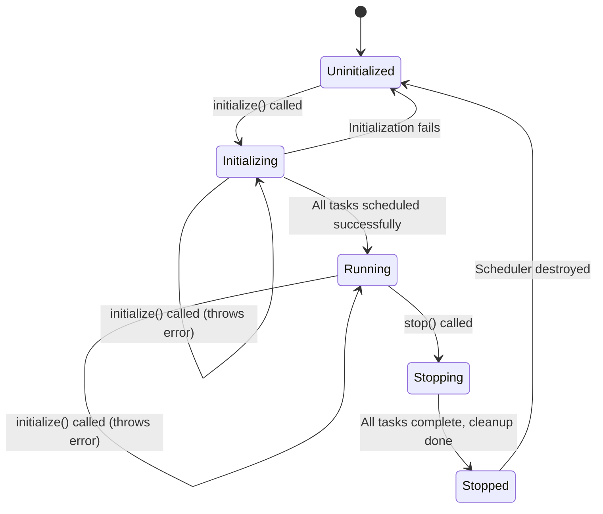
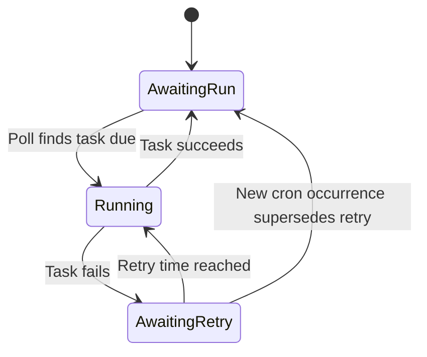
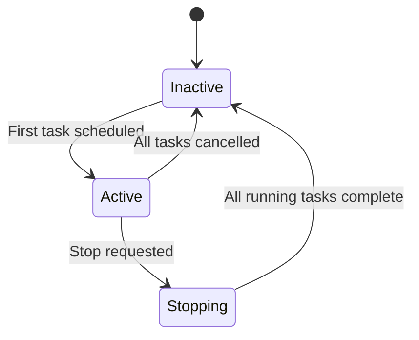

# Specification for the Declarative Scheduler

This document provides a normative specification for the backend declarative scheduler's public interface and externally observable operational semantics.

---

## Introduction & Normative Language

This specification defines the externally observable behavior of the Declarative Scheduler. It serves as:

- An integration contract for other teams
- A foundation for conformance testing
- A guide for independent re-implementations
- A behavioral lock for future refactors

### Normative Language

The key words "MUST", "MUST NOT", "REQUIRED", "SHALL", "SHALL NOT", "SHOULD", "SHOULD NOT", "RECOMMENDED", "MAY", and "OPTIONAL" in this document are to be interpreted as described in [RFC 2119](https://tools.ietf.org/html/rfc2119) and [RFC 8174](https://tools.ietf.org/html/rfc8174).

### Scope

**In scope:** Public interface (`initialize`, `stop`) and all externally observable behaviors including timing, persistence, logging, errors, and state transitions.

**Out of scope:** Internal module structure, private helper APIs, storage engine internals beyond externally visible effects.

---

## Public API Surface

The scheduler exposes exactly two public methods forming a minimal lifecycle interface.

### Scheduler Interface

A `Scheduler` instance **MUST** provide the following interface:

```javascript
interface Scheduler {
    initialize(registrations: Registration[]): Promise<void>
    stop(): Promise<void>
}
```

### Registration Format

A `Registration` **MUST** be a 4-tuple array with the following structure:

```javascript
type Registration = [
    string,     // Task name (unique identifier)
    string,     // Cron expression (POSIX format)
    Callback,   // Async function to execute
    Duration    // Retry delay duration
]
```

Where:
- **Task name** **MUST** be a non-empty string unique within the registration set
- **Cron expression** **MUST** be a valid POSIX 5-field cron expression
- **Callback** **MUST** be an async function `() => Promise<void>`
- **Duration** **MUST** be a non-negative time duration

---

## Operational Model & Time Semantics

### Time Provider and Granularity

The scheduler **MUST**:
- Use the host system's local clock as the authoritative time source
- Operate at minute-level granularity
- Evaluate task schedules at each minute boundary
- Consider a minute boundary to occur at the start of each minute (seconds = 0)

### Timely Behavior

The scheduler **MUST**:
- Handle multiple due tasks in parallel with no ordering guarantees

The scheduler **MUST**:
- Use the host system's local timezone for all time calculations
- Handle Daylight Saving Time (DST) transitions according to the host system's clock
- Consider a minute that does not exist during DST transitions (e.g., 2:30 AM during "spring forward") as automatically skipped
- Execute tasks **multiple times** for minutes that occur twice during DST transitions (e.g., 2:30 AM during "fall back")
- Continue normal scheduling after DST transitions without requiring restart

**DST Transition Behavior:**
- **Spring Forward (Lost Hour):** Tasks scheduled during the skipped hour **MUST NOT** execute that day
- **Fall Back (Repeated Hour):** Tasks scheduled during the repeated hour **MUST** execute both times the minute occurs
- **Next Execution Calculation:** **MUST** correctly account for DST transitions when calculating future occurrences

### No Make-Up Execution Policy

**Critical Invariant:** When tasks miss multiple scheduled executions due to downtime, the scheduler **MUST** execute each task at most once when resuming, regardless of how many executions were missed.

**Rationale:** This prevents resource overwhelming and maintains predictable load patterns.

**Example:** A task scheduled `15,30,45,0 * * * *` (every 15 minutes) that misses 4 executions during a 1-hour outage **MUST** run only once when the scheduler resumes, not 4 times.

### Startup Semantics

#### First Startup (No Persisted State)

For every task, which has not yet been persisted, the scheduler **MUST**:
1. Evaluate task's cron expression against the current time
2. Execute immediately if and only if cron expression **exactly matches** the current minute
3. Schedule task for its next future occurrence

#### Subsequent Restarts (With Persisted State)

When persisted state exists, the scheduler **MUST**:
1. Load the previous execution state
2. Apply persistence override logic (see [Persistence Semantics](#persistence-semantics--overrides))
3. Continue normal scheduling based on last known attempt/success/failure times

---

## Scheduler Lifecycle

### Scheduler State Model

The scheduler **MUST** exist in exactly one of the following states:



### Scheduler State Definitions

- **Uninitialized:** Scheduler created but not yet initialized
- **Initializing:** Processing registrations, applying overrides, starting tasks
- **Running:** Normal operation with polling active and tasks scheduled
- **Stopping:** Graceful shutdown in progress, waiting for running tasks
- **Stopped:** Cleanup complete, no active polling or tasks

### Scheduler State Transitions

#### Uninitialized to Initializing

**Guard:** `initialize(registrations)` called with valid input

**Action:** Begin validation, persistence override resolution

**Events:** `SchedulerInitializationStarted`

#### Initializing to Running

**Guard:** All registrations validated, overrides applied, tasks scheduled

**Action:** Start polling loop, mark scheduler as active

**Events:** `SchedulerInitializationCompleted`

#### Initializing to Uninitialized

**Guard:** Initialization fails due to validation errors

**Action:** Clean up partial state, reset to uninitialized

**Events:** `SchedulerInitializationFailed`

#### Initializing to Initializing (Error State)

**Guard:** `initialize(registrations)` called while scheduler is already initializing

**Action:** Throw `SchedulerAlreadyActiveError` with state "initializing"

**Events:** None (error thrown synchronously)

#### Running to Running (Error State)

**Guard:** `initialize(registrations)` called while scheduler is running

**Action:** Throw `SchedulerAlreadyActiveError` with state "running"

**Events:** None (error thrown synchronously)

#### Running to Stopping

**Guard:** `stop()` called

**Action:** Stop accepting new polls, wait for running tasks

**Events:** `SchedulerStopRequested`

#### Stopping to Stopped

**Guard:** All running tasks complete, polling stopped

**Action:** Final cleanup, release resources

**Events:** `SchedulerStopped`

---

## Task Lifecycle

### Task State Model

Each task **MUST** exist in exactly one of the following states:



### Task State Definitions

- **AwaitingRun:** Task is waiting for its next cron occurrence
- **Running:** Task callback is currently executing
- **AwaitingRetry:** Task failed and is waiting for retry delay to pass

### Task State Transitions

#### From AwaitingRun to Running

**Guard:**

Either Case A or Case B.

- Case A:
  Current minute matches the cron expression AND the task has not been run this minute.

- Case B:
  There has been a time in the past when the cron expression matched, but the scheduler missed it, except if the task has never run before.

**Action:** Invoke task callback, record attempt timestamp

**Events:** `TaskRunStarted`

#### From Running to AwaitingRun

**Guard:** Task callback completes successfully

**Action:** Record success timestamp, clear any pending retry

**Events:** `TaskRunCompleted`

#### From Running to AwaitingRetry

**Guard:** Task callback throws an error or rejects

**Action:** Record failure timestamp, calculate `pendingRetryUntil = now + retryDelay`

**Events:** `TaskRunFailed`

#### From AwaitingRetry to Running

**Guard:** Current time $\geq$ `pendingRetryUntil`

**Action:** Clear retry state, invoke task callback, record attempt timestamp

**Events:** `TaskRetryStarted`

#### From AwaitingRetry to AwaitingRun

**Guard:** New cron occurrence is due while task is in retry state

**Action:** Clear retry state, proceed with cron execution

**Events:** `TaskRetryPreempted`, `TaskRunStarted`

### Timestamp Management

The scheduler **MUST** maintain the following timestamps for each task:
- `lastAttemptAt`: Timestamp of most recent execution attempt (success or failure)
- `lastSuccessAt`: Timestamp of most recent successful execution (if any)
- `pendingRetryUntil`: Timestamp when retry is allowed (if in AwaitingRetry state)

---

## Polling Lifecycle

### Polling State Model



### State Definitions

- **Inactive:** No polling loop running, no tasks scheduled
- **Active:** Polling loop running, evaluating scheduled tasks
- **Stopping:** Stop requested, waiting for running tasks to complete

### State Transitions

#### Inactive to Active

**Guard:** First task is scheduled via `schedule()` call

**Action:** Start polling loop

**Events:** `PollingStarted`

#### Active to Inactive

**Guard:** Last scheduled task is cancelled via `cancel()` call

**Action:** Stop polling loop

**Events:** `PollingStopped`

#### Active to Stopping

**Guard:** `stopLoop()` is called

**Action:** Mark scheduler as stopping, complete current poll cycle

**Events:** `PollingStopRequested`

#### Stopping to Inactive

**Guard:** All currently running tasks complete execution

**Action:** Final cleanup, release resources

**Events:** `PollingStopped`

---

## Cron Language Specification

The scheduler **MUST** accept strictly POSIX-compliant cron expressions as defined in IEEE Std 1003.1.

### Formal Grammar (EBNF)

```ebnf
cron-expr    = SP* minute SP+ hour SP+ day SP+ month SP+ weekday SP* ;
minute       = field-content ;
hour         = field-content ;
day          = field-content ;
month        = field-content ;
weekday      = field-content ;

field-content = "*" / element-list ;
element-list  = element ("," element)* ;
element       = number / range ;
range         = number "-" number ;
number        = DIGIT+ ;

SP           = " " / "\t" ;
DIGIT        = "0" / "1" / "2" / "3" / "4" / "5" / "6" / "7" / "8" / "9" ;
```

### Field Ranges

- **minute**: 0–59
- **hour**: 0–23
- **day**: 1–31
- **month**: 1–12
- **weekday**: 0–6 (0 = Sunday, 6 = Saturday)

### Validation Rules

The scheduler **MUST** reject expressions that:
1. Do not contain exactly 5 fields separated by whitespace
2. Contain step syntax (`/N`)
3. Contain named values (`jan`, `mon`, `sunday`)
4. Contain macro expressions (`@daily`, `@hourly`)
5. Contain Quartz-specific tokens (`?`, `L`, `W`, `#`)
6. Contain weekday value `7` (use `0` for Sunday)
7. Contain wrap-around ranges where start > end
8. Contain values outside the valid range for each field
9. Contain non-decimal numeric formats (scientific notation, hex, signs)

### Day-of-Month/Day-of-Week Semantics

When both day-of-month (DOM) and day-of-week (DOW) are restricted (not `*`), the scheduler **MUST** execute the task if **either** condition matches (OR logic).

**Truth Table:**
| DOM | DOW | Logic | Example | Runs On |
|-----|-----|-------|---------|---------|
| `*` | `*` | AND | `0 0 * * *` | Every day at midnight |
| `*` | restricted | DOW only | `0 0 * * 1` | Every Monday at midnight |
| restricted | `*` | DOM only | `0 0 15 * *` | 15th of every month at midnight |
| restricted | restricted | OR | `0 0 1,15 * 1` | 1st, 15th, OR every Monday at midnight |

### Examples

**Valid expressions:**
- `0 0 * * *` - Daily at midnight
- `15 3 * * 1-5` - 3:15 AM on weekdays
- `0,30 * * * *` - Every 30 minutes
- `0 12 14 2 *` - Noon on February 14th

**Invalid expressions:**
- `*/15 * * * *` - Step syntax not allowed
- `0 0 * * mon` - Named values not allowed
- `@daily` - Macros not allowed
- `0 0 ? * *` - Quartz tokens not allowed

---

## Error Model

### Error Taxonomy

The scheduler **MUST** throw the following error types under the specified conditions:

#### Registration Validation Errors

**RegistrationsNotArrayError**
- **When:** `initialize()` called with non-array registrations parameter
- **Message:** `"Registrations must be an array"`
- **Details:** None

**RegistrationShapeError**
- **When:** Registration tuple has wrong length or invalid types
- **Message:** `"Invalid registration shape: expected [string, string, function, Duration]"`
- **Details:** `{ registrationIndex: number, received: any }`

**InvalidRegistrationError**
- **When:** Registration contains invalid data beyond shape issues
- **Message:** Varies based on specific validation failure
- **Details:** `{ field: string, value: any, reason: string }`

**ScheduleDuplicateTaskError**
- **When:** Multiple registrations have the same task name
- **Message:** `"Task with name \"<name>\" is already scheduled"`
- **Details:** `{ taskName: string }`

**SchedulerAlreadyActiveError**
- **When:** `initialize()` called while scheduler is already initializing or running
- **Message:** `"Cannot initialize scheduler: scheduler is already <state>"` where state is "initializing" or "running"
- **Details:** `{ currentState: string }`

**CronExpressionInvalidError**
- **When:** Cron expression fails validation
- **Message:** `"Invalid cron expression \"<expr>\": <field> field <reason>"`
- **Details:** `{ expression: string, field: string, reason: string }`

**NegativeRetryDelayError**
- **When:** Retry delay is negative
- **Message:** `"Retry delay must be non-negative"`
- **Details:** `{ retryDelayMs: number }`

#### Cron Expression Parsing Errors

**InvalidCronExpressionError** (from expression module)
- **When:** Cron parsing fails due to syntax errors
- **Message:** `"Invalid cron expression \"<expr>\": <field> field <reason>"`
- **Details:** `{ expression: string, field: string, reason: string }`

**FieldParseError**
- **When:** Individual field parsing fails within cron expression
- **Message:** Specific to field validation failure
- **Details:** `{ fieldValue: string, fieldName: string }`

#### Cron Calculation Errors

**CronCalculationError**
- **When:** Date calculation fails: no future or previous occurrences
- **Message:** `"Failed to calculate next occurrence: <cause>"`
- **Details:** `{ expression: string, currentTime: string, cause: Error }`

#### Task State Management Errors

**TaskTryDeserializeError** (Base class)
- **When:** Task state deserialization fails
- **Message:** Varies based on specific failure
- **Details:** `{ field: string, value: any, expectedType: string }`

**TaskMissingFieldError**
- **When:** Required field missing from persisted task state
- **Message:** `"Missing required field: <field>"`
- **Details:** `{ field: string }`

**TaskInvalidTypeError**
- **When:** Field has wrong type in persisted task state
- **Message:** `"Invalid type for field '<field>': expected <expected>, got <actual>"`
- **Details:** `{ field: string, value: any, expectedType: string, actualType: string }`

**TaskInvalidValueError**
- **When:** Field has invalid value in persisted task state
- **Message:** `"Invalid value for field '<field>': <reason>"`
- **Details:** `{ field: string, value: any, reason: string }`

**TaskInvalidStructureError**
- **When:** Task state structure is fundamentally invalid
- **Message:** Varies based on structural issue
- **Details:** `{ value: any }`

### Error Throwing Guarantees

The scheduler **MUST**:
- Throw validation errors synchronously during `initialize()` before any scheduling begins
- Wrap and re-throw unexpected errors with enhanced context
- Preserve original error information in `details.cause` when wrapping
- Use consistent error names and message formats across versions
- Include sufficient detail in error messages for debugging without exposing security-sensitive information

## Persistence Semantics & Overrides

### Override Resolution

When `initialize()` is called, the scheduler **MUST** compare provided registrations against persisted state and categorize each task as:

#### Classification Types

**New Task:** Exists in registrations but not in persisted state
- **Action:** Create new task state, apply first startup semantics

**Preserved Task:** Exists in both with identical configuration
- **Action:** Load existing state, continue normal scheduling

**Overridden Task:** Exists in both but with different configuration
- **Action:** Update persisted state with new configuration, keep execution history (attempts, successes, failures)

**Orphaned Task:** Exists in both. Was started by previous instance, but has not finished under it.
- **Action:** Update persisted state with new configuration, but set to restart immediately.

### Configuration Comparison

Tasks are considered **identical** if and only if:
1. Task name matches exactly
2. Cron expression string matches exactly
3. Retry delay duration matches exactly

Any difference in the above fields **MUST** trigger override behavior.

### Scheduler Identifier

The scheduler **MUST**:
- Generate a unique identifier on first initialization
- Use this identifier to detect orphaned tasks from other scheduler instances

### Override Atomicity

All persistence override operations **MUST** be applied atomically. If any override operation fails, the scheduler **MUST** restore the previous state and throw an error.

---

## Concurrency & Reentrancy

### Parallel Execution

The scheduler **MUST**:
- Allow multiple tasks to execute concurrently
- Provide no ordering guarantees between simultaneous task executions
- Ensure each individual task executes serially (no concurrent executions of the same task)

### Reentrancy Protection

The scheduler **MUST**:
- Allow multiple concurrent calls to `initialize()`
- Allow `stop()` to be called during `initialize()`
- Ensure `stop()` waits for any in-progress `initialize()` to complete

### Resource Management

The scheduler **MUST**:
- Wait for all running tasks to complete before `stop()` returns
- Clean up polling resources regardless of task completion success
- Handle task execution failures without affecting other running tasks

---

## Determinism & Idempotency

### Deterministic Behavior

Given identical inputs, the scheduler **SHOULD** produce deterministic outputs:
- Same registrations + same persisted state + same wall clock time = same execution decisions
- Task execution order within a poll **MAY** vary but task selection **MUST** be deterministic

### Idempotency Guarantees

**`initialize()` Idempotency:**
- Multiple calls with identical registrations **MUST** have no additional effect
- Subsequent calls **MUST** not duplicate task scheduling
- Override detection **MUST** work correctly across multiple calls

**State Persistence Idempotency:**
- Writing the same state multiple times **MUST** be safe
- Partial failures **MUST** not corrupt state
- Recovery from crashes **MUST** restore consistent state

### Non-Deterministic Elements

The following behaviors **MAY** vary between equivalent runs:
- Exact execution timing within the same minute
- Task execution order within a single poll
- Specific polling interval timing (as long as all minutes are covered)

---

## Formal Theory of Observable Behavior

This specification contains a formal, mathematical model of the scheduler's observable behavior.
This model is defined in the companion document [scheduler-theory.md](scheduler-theory.md).

---

## Real-time bounds

These are operational timing requirements for implementations and operators.
They are engineering targets.

**R1 — Scheduling latency target.**
When the scheduler is running and a task is due according to the cron layer (i.e., the system clock reaches the minute boundary specified by the task's cron expression), the implementation SHOULD start the task's callback within approximately **1 minute** of that minute boundary, assuming no deliberate stop is in progress and the task is not running already. This upper bound SHOULD scale linearly with the number of scheduled tasks (e.g., 100000 tasks = 10 minutes, 1000000 tasks = 100 minutes), but implementations SHOULD keep this as low as possible through efficient scheduling algorithms.

**R2 — Post‑restart recovery target.**
If the scheduler process restarts while a task callback was in flight, then after restart and once the task is present in the active registrations and eligible to run, the implementation SHOULD start the task's callback within approximately **1 minute** of the next eligible minute boundary, assuming no deliberate stop is in progress and the task is not running already. This upper bound SHOULD scale linearly with the number of scheduled tasks (e.g., 100000 tasks = 10 minutes, 1000000 tasks = 100 minutes), but implementations SHOULD keep this as low as possible through efficient scheduling algorithms.

### Assumptions & Notes

External factors such as OS suspension, VM pauses, heavy load, or administrative throttling can and will extend observed latencies beyond these targets; implementations SHOULD surface such deviations in metrics/logs so operators can take corrective action.

---

## References & Glossary

### References

1. [RFC 2119](https://tools.ietf.org/html/rfc2119) - Key words for use in RFCs to Indicate Requirement Levels
2. [RFC 8174](https://tools.ietf.org/html/rfc8174) - Ambiguity of Uppercase vs Lowercase in RFC 2119 Key Words
3. [POSIX crontab](https://pubs.opengroup.org/onlinepubs/9699919799/utilities/crontab.html) - The Open Group Base Specifications
4. [POSIX Programmer's Manual](https://man7.org/linux/man-pages/man1/crontab.1p.html) - crontab(1p)

### Glossary

**Cron Expression:** A POSIX-compliant 5-field time specification string

**Declarative Configuration:** Task definitions provided as data rather than imperative commands

**Make-Up Execution:** Executing missed occurrences after downtime (explicitly NOT supported)

**Override:** Replacing persisted task configuration with new registration data

**Polling:** Periodic evaluation of task schedules to determine execution

**Registration:** A 4-tuple defining a scheduled task's identity, schedule, callback, and retry behavior

**Task:** A scheduled unit of work with associated execution state

**Temporal Granularity:** The minimum time resolution for scheduling (1 minute)
